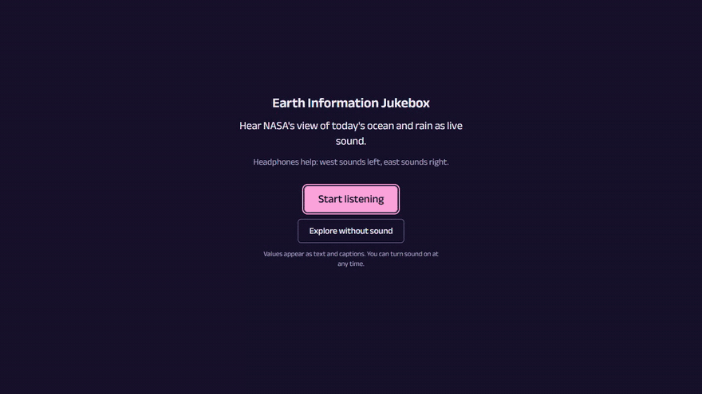
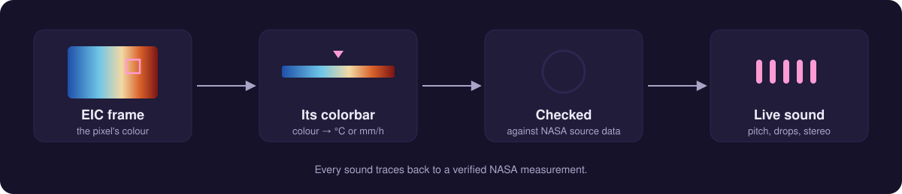
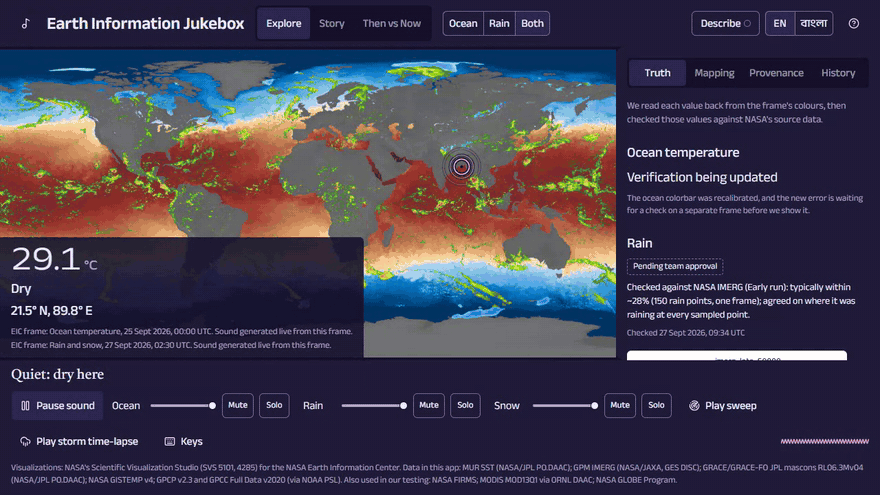
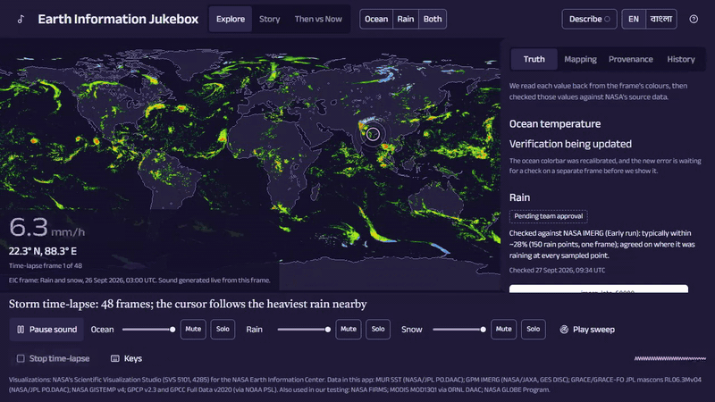
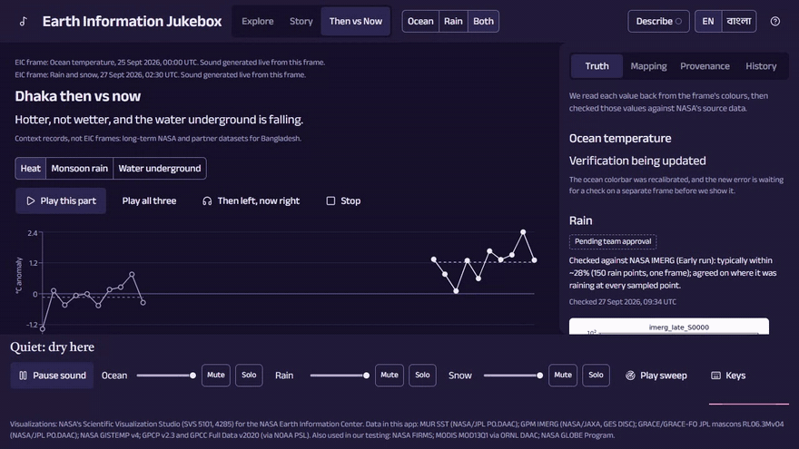
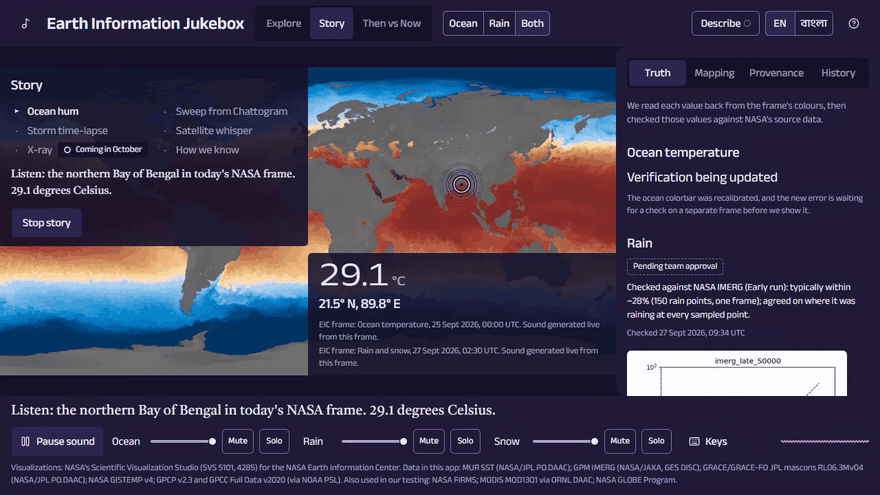
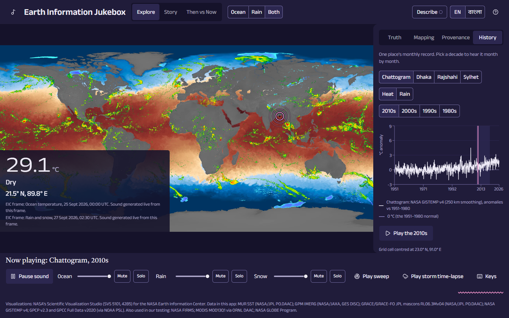
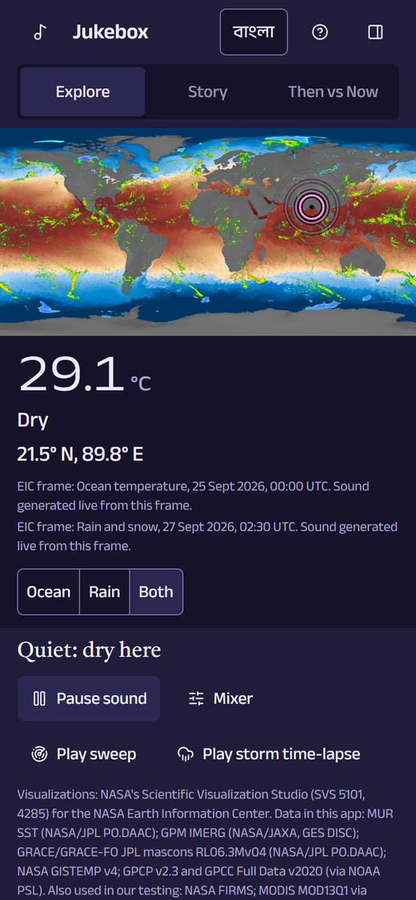

<div align="center">



<p>
  
  
  
  
  
  
  
  
</p>

**Hear exactly what NASA's Earth Information Center is showing, and trust it:<br>every sound traces back to a verified NASA measurement.**

Built by **Team PTSD** for the NASA Space Apps Challenge 2026.

[What you can do](#what-you-can-do) · [How it works](#how-it-works) · [Run it](#run-it) · [Accessibility](#made-to-be-heard) · [Credits](#credits)

</div>

<br>

<div align="center">
  
  <br>
  <sub><b>"Close your eyes."</b> Ten seconds of today's real ocean and rain as sound, then the NASA frame opens out from the equator.</sub>
</div>

<br>

## The idea

NASA's Earth Information Center (EIC) publishes stunning visualizations of our planet, but they are for eyes only. The Jukebox takes the **exact EIC frame on screen** (today's sea surface temperature, the latest half-hourly rainfall) and turns each pixel's colour back into the value it stands for, using the frame's own colorbar. Those values become **sound, generated live** while you explore. Then we **check the values against NASA's source datasets** and show how close they are.

Blind and low-vision users can explore the planet by ear with a keyboard and speech. Everyone else hears patterns like the monsoon moving over the Bay of Bengal.

## How it works



| Warmer ocean | More rain | Snow | West ↔ East | No data |
|:---:|:---:|:---:|:---:|:---:|
| a higher pitch | denser drops | soft bells | left ↔ right ear | silence and a short tick |

Every rule and number lives in one file, [`public/mapping.json`](public/mapping.json), and the app's **Mapping** panel explains each one in words.

## What you can do

<table>
  <tr>
    <td width="50%" valign="top">
      
      <h3>🎧 Explore by ear</h3>
      Move the cursor with the arrow keys, a mouse or a finger. The ocean hums, rain falls as drops, and pink rings pulse with the actual sound. Press <kbd>Enter</kbd> to hear the value spoken, followed by a chime naming the satellite that measured it.
    </td>
    <td width="50%" valign="top">
      
      <h3>⛈️ Storm time-lapse</h3>
      The last 48 half-hourly IMERG rain frames at 2 frames per second. The cursor follows the heaviest rain near Bangladesh, and each frame's own value and time appear on screen.
    </td>
  </tr>
  <tr>
    <td width="50%" valign="top">
      
      <h3>🌡️ Dhaka then vs now</h3>
      <i>Hotter, not wetter, and the water underground is falling.</i> Heat (NASA GISTEMP), monsoon rain (GPCP, cross-checked with GPCC rain gauges) and groundwater (GRACE), each with a chart whose playhead follows the sound. Play them one after the other, or "then" in your left ear and "now" in your right.
    </td>
    <td width="50%" valign="top">
      
      <h3>📖 Story Mode</h3>
      A guided tour of about 90 seconds: the ocean hum over the Bay of Bengal, a sweep from Chattogram, the storm, the satellite whisper, and how we know the sound is right. Every number spoken is read from NASA data files.
    </td>
  </tr>
</table>

<table>
  <tr>
    <td width="68%" valign="top">
      
    </td>
    <td width="32%" valign="top" align="center">
      
    </td>
  </tr>
  <tr>
    <td valign="top"><sub><b>Place History:</b> a decade of monthly heat or rain for Chattogram, Dhaka, Rajshahi or Sylhet, month by month with a playhead. Beside it, the <b>Truth</b>, <b>Mapping</b> and <b>Provenance</b> panels.</sub></td>
    <td valign="top" align="center"><sub><b>On a phone:</b> the same app, with 44 px touch targets.</sub></td>
  </tr>
</table>

### And also

- **🌊 Sweep:** rings of sound spread out from Chattogram across the Bay of Bengal.
- **🔍 Truth panel:** how each value was checked against NASA's source data, with the measured error.
- **🧭 Provenance panel:** for the point on screen, its value, dataset, NASA SVS visualization and frame time.
- **🎼 Legend and warm-up:** hear what 0, 10, 20 and 30 °C, light and heavy rain, and snow sound like before you explore.

## Made to be heard

Accessibility is the point of the project, not an extra.

| | |
|---|---|
| ⌨️ **Keyboard first** | Arrow keys move the cursor (<kbd>Shift</kbd> for 10°), <kbd>Enter</kbd> speaks, <kbd>Space</kbd> pauses, <kbd>1</kbd> <kbd>2</kbd> <kbd>3</kbd> switch tracks, <kbd>S</kbd> sweeps, <kbd>Esc</kbd> stops everything. <kbd>H</kbd> lists every key. |
| 🗣️ **Screen readers** | The map is one focusable region; settled values are announced once, never spammed. |
| 💬 **Captions** | Every sound has a caption. **Describe** mode says what is playing. |
| 🔇 **Without sound** | "Explore without sound" shows values as text and captions. |
| 🌀 **Reduced motion** | Follows the system setting: still rings, cuts instead of wipes. |
| 🇧🇩 **English / বাংলা** | Every string in the app goes through one table, ready for Bangla. |

## Run it

You need [Bun](https://bun.sh).

```sh
bun install
bun run dev      # open http://localhost:3000
```

> [!TIP]
> Wear headphones: west sounds left, east sounds right. Browsers start sound only after a click, so press **Start listening**.

| Command | What it does |
|---|---|
| `bun run build` then `bun run start` | Production build and server |
| `bun run lint` | ESLint |
| `bunx tsc --noEmit` | Type check |
| `bun test` | Unit tests |

The audio engine's test page (`/dev/audio`) is available in development only. For a test deployment that includes it, build with `AUDIO_HARNESS=1 bun run build`.

<details>
<summary><b>Rebuilding the data (optional)</b></summary>

<br>

The data the app reads is already in `public/data/`. To rebuild it you need Python, the packages in `pipeline/requirements.txt`, and a NASA Earthdata login:

```sh
cd pipeline
pip install -r requirements.txt
python run_all.py            # options: --no-sequence --no-context --with-global
```

</details>

<details>
<summary><b>Project layout</b></summary>

<br>

| Path | What it holds |
|---|---|
| `src/app/`, `src/components/` | The web app (Next.js, React, shadcn/ui) |
| `src/lib/audio/` | The sound engine (Web Audio); its public API is `@/lib/audio` |
| `src/lib/audio-adapter/` | The one place the UI connects to the sound engine |
| `src/lib/data/` | Data loaders and the grid decoder |
| `public/mapping.json` | Every value-to-sound rule and tuned number |
| `public/data/` | The data files the app reads (grids, JSON) |
| `pipeline/` | Python scripts that build `public/data/` |
| `docs/` | The team build plan and each lane's notes |

</details>

## Honesty rules

> [!IMPORTANT]
> - No number appears unless it comes from our data files or our tests.
> - The sound is generated live; the data is near real time, and the frame's time is always shown.
> - Comparisons use multi-year windows; single years are labelled "example years".
> - Anything not working yet is labelled "Coming in October". Wording still under team review carries a "Pending team approval" badge.

## Credits

Visualizations: NASA's Scientific Visualization Studio (SVS 5101, 4285) for the NASA Earth Information Center.

Data in this app: MUR SST (NASA/JPL PO.DAAC); GPM IMERG (NASA/JAXA, GES DISC); GRACE/GRACE-FO JPL mascons RL06.3Mv04 (NASA/JPL PO.DAAC); NASA GISTEMP v4; GPCP v2.3 and GPCC Full Data v2020 (via NOAA PSL).

Also used in our testing: NASA FIRMS; MODIS MOD13Q1 via ORNL DAAC; NASA GLOBE Program.

We follow each dataset's own acknowledgement text where one is provided (for example GRACE and GPCP).

**Partner agencies:** IMERG comes from the joint NASA–JAXA GPM mission. MUR includes JAXA AMSR2 and EUMETSAT sea-ice inputs. GPCC is from Germany's national weather service (Deutscher Wetterdienst).

**Audio:** all sound is generated by our code; there is no third-party music and there are no samples.

## Licence

[MIT](LICENSE) © 2026 Team PTSD.

## Use of AI

AI tools helped with coding and writing. AI never produces the numbers you see or hear: every value comes from NASA data, read by our code.
